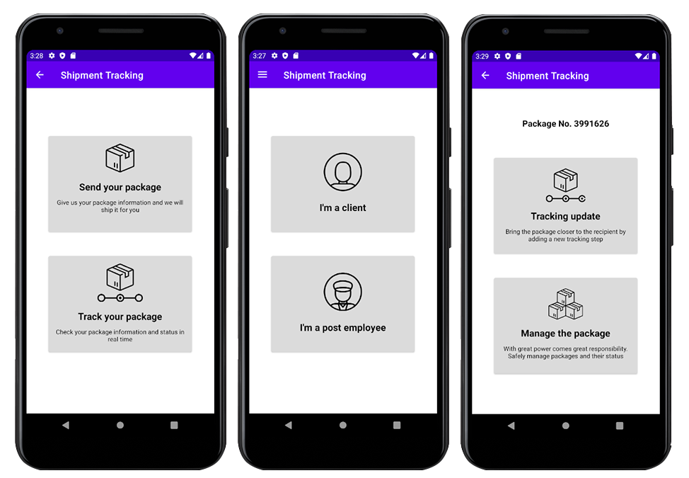

            

#

    <strong>A native Android application that simulates a package tracking from both the client and postman sides 📦📯</strong>

    

 

The Shipment Tracking application was developed with the sole purpose of learning how to create native Android applications and interconnect it with different services, local or cloud.

The technology used for this project rely entirely on Java.

## Table of Contents

1. [Getting Started](#getting-started)
2. [Guides and resources](#guides-and-resources)
3. [Authors](#authors)
4. [License](#license)

## Getting Started

### Prerequisites

**There are two branches : `main` and `firebase-implementation`. Which one do I have to choose if I just want to test the app ?!**

👉 The only difference between the two branches is the database implementation :
- `main` contains the application that runs with the **Room local database** provided by Android. If you choose this option, the application will store the data **locally** inside your device.

- `firebase-implementation` contains the application that runs with the **Firebase cloud database**, provided by Google. If you choose this option, the application will store the data **remotely** inside the firebase cloud.

💡 We recommend to use the version of the application that is on the `main` branch because you will not have any problem that could arise with the Firebase database _(database no longer maintained, you are not connected to internet, etc)_ and in bonus you can inspect the data stored by the application thanks to the _Database Inspector_ tab of Android Studio. 

### Installing

You will need to follow the steps below in order to run the application :

1. Install [Android Studio](https://developer.android.com/studio)
2. Download the project files in ZIP format to your computer.
3. Unzip the downloaded file.
4. Open the project folder _(the unzipped folder)_ in Android Studio.
5. Run the android application with Android Studio.

Once these four steps have been executed, you will be able to use the **Shipment-Tracking** application and to experience the life of a postman!

## Guides and resources

* [Android Studio](https://developer.android.com/studio) - Android Studio
* [Firebase Database](https://firebase.google.com/?hl=fr) - Firebase Database

## Authors

<table width="200px">
   <tbody>
      <tr>
         <td align="center">
            <a href="https://github.com/d-roduit">
             
            Daniel Roduit
            </a>
         </td>
         <td align="center">
            <a href="https://gitlab.com/g.cathy">
             
            Cathy Gay
            </a>
         </td>
      </tr>
   </tbody>
</table>

## License

This project is licensed under the MIT License
